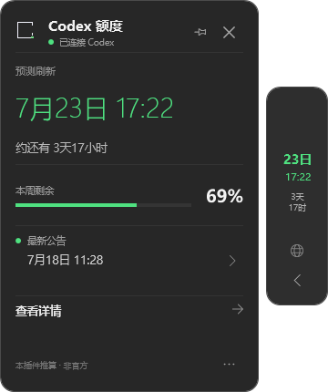
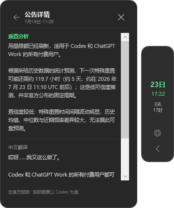

# Codex 额度雷达 · Codex Reset Watcher

一个面向 Windows 的 Codex 桌面端悬浮额度助手。它把“预计什么时候刷新额度”放在第一位，同时显示本机剩余额度、公开公告、中文翻译与 Codex 分析。

> 非官方项目。预测结果来自公开历史公告的统计推算，不代表 OpenAI、Codex 或公告作者的承诺；实际额度与重置时间始终以 Codex 客户端为准。

## 界面预览

| 紧凑主面板 | 公告与分析 |
| --- | --- |
|  |  |

| 右侧窄轨 | 最小浮标 |
| --- | --- |
|  |  |

## 主要功能

- **刷新时间优先**：窄轨和浮标始终保留预计刷新日期、时间与倒计时。
- **本机额度读取**：通过 Codex 本机 `app-server` 的只读接口获取剩余额度与官方重置时间。
- **公开公告跟踪**：读取 `codex-resets.com` 汇总的 Tibo Sottiaux（[@thsottiaux](https://x.com/thsottiaux)）公开公告。
- **中文为主**：默认显示中文；Codex CLI 在本机完成公告翻译和简要分析，也可切换英文。
- **只在 Codex 出现**：Codex 位于前台时显示，切换到其他软件后自动隐藏。
- **三种紧凑形态**：`360 × 430` 主面板、`68 × 240` 窄轨、`48 × 126` 最小浮标。
- **自然交互**：点击窄轨中部展开，再点同一区域收回；主面板非按钮区域可拖动，位置自动保存。
- **新公告提醒**：提供窄轨标记、窗口内提示和 Windows 通知，同一公告不会重复提醒。
- **本地缓存**：网络不可用时读取最近一次成功结果。

## 系统要求

- Windows 10 或 Windows 11
- 已安装并登录 Codex 桌面端
- Windows PowerShell 5.1 或 PowerShell 7
- 访问公开公告时需要联网

不需要登录 X，也不需要单独配置 OpenAI API Key。

## 安装与运行

### 直接体验

下载并解压仓库或 Release，在项目目录执行：

```powershell
powershell.exe -NoProfile -ExecutionPolicy Bypass -File .\scripts\Show-LatestReset.ps1 -StartCollapsed
```

### 随 Codex 自动出现

安装登录启动监听：

```powershell
powershell.exe -NoProfile -ExecutionPolicy Bypass -File .\scripts\Install-Autostart.ps1
```

安装后重新登录 Windows，或直接运行：

```powershell
powershell.exe -NoProfile -ExecutionPolicy Bypass -File .\scripts\Watch-Codex.ps1
```

监听器只负责观察 Codex 是否运行；Codex 关闭后悬浮窗会同步退出。

### 卸载自启动

```powershell
powershell.exe -NoProfile -ExecutionPolicy Bypass -File .\scripts\Uninstall-Autostart.ps1
```

随后删除项目目录即可。运行缓存位于 `%LOCALAPPDATA%\CodexResetWatcher`，如需彻底清理可手动删除该目录。

## 数据、预测与准确性

- 最新公告来自公开追踪页 [`codex-resets.com`](https://codex-resets.com/)，原帖链接指向 X。
- “下一次全体刷新”使用历史公告间隔的中位数推算，属于低可信度统计预测。
- 本机额度从本地 Codex `app-server` 的 `account/rateLimits/read` 读取，不会把账号令牌发送到本项目服务器。
- Codex CLI 的翻译和分析在本机执行；本项目不提供独立后端，也不运营用户数据库。
- 公告页面结构、Codex 本地接口或额度规则变化后，功能可能需要跟随更新。

更完整的隐私说明见 [PRIVACY.md](PRIVACY.md)。

## 项目结构

```text
.codex-plugin/              Codex 插件清单
assets/                     图标资源
docs/screenshots/           README 展示截图
scripts/                    窗口、额度读取、公告和自启动脚本
skills/codex-reset-watcher/ Codex 对话技能
```

## 常用脚本

```powershell
# 获取最新公开公告
.\scripts\Get-LatestReset.ps1 -AsJson

# 读取本机 Codex 额度
.\scripts\Get-CodexUsage.ps1 -AsJson

# 打开悬浮窗
.\scripts\Show-LatestReset.ps1 -StartCollapsed
```

## English summary

Codex Reset Watcher is an unofficial Windows companion for the Codex desktop app. It prioritizes an estimated global reset time, shows local quota data from the Codex app-server, tracks public reset announcements, and provides Chinese translation and local Codex analysis. The widget appears only while Codex is active and supports an expanded drawer, a compact edge rail, and a minimal floating badge.

The global reset estimate is statistical and unofficial. Always rely on the Codex client for actual quota and reset information. No X login or standalone OpenAI API key is required.

## 许可证

[MIT License](LICENSE)

## 致谢与声明

感谢公开公告作者与 [`codex-resets.com`](https://codex-resets.com/) 提供可查询的信息来源。本项目与 OpenAI、Codex、X、Tibo Sottiaux 及该追踪站点均无隶属或授权关系。
